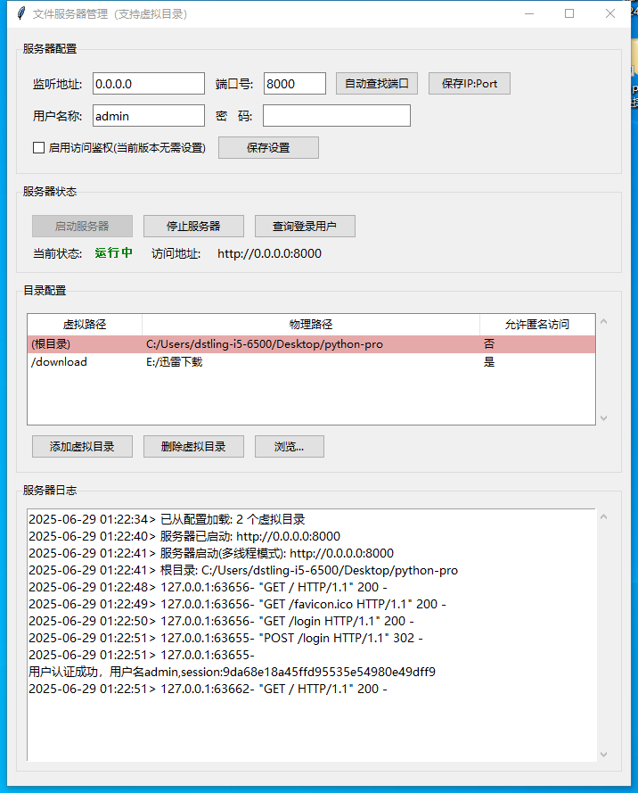

# httpd-ui-python
#How to run

1.安装python3

2.clone本代码

3.cd /path/to/httpd-ui-python

4.python3 server_ui.py

#程序使用介绍
First run, this programe will create default json config file:server_config.json
In the default UI of the program, you can set the root directory and 
virtual directory, save, and restart. The default username is admin, 
and the password is admin123456. 
You can modify this setting in the UI.

#页面介绍：
1.主界面截图(服务端)

2.用户管理界面(服务端)

3.未登录主页面(浏览器)

4.登录界面(浏览器)

5.登录后主页面(浏览器)

