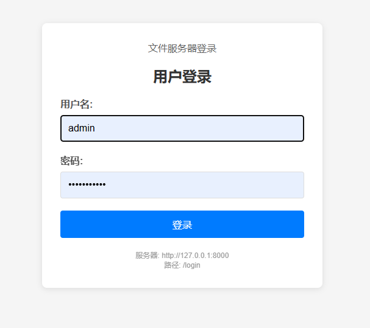

# httpd-ui-python
#一、How to run 如何运行

1.安装python3  

windows:  https://www.python.org/ftp/python/3.12.0/python-3.12.0-amd64.exe

linux:  

sudo apt install python3  

sudo apt-get install python3-pil python3-pystray python3-pil.imagetk

或者源码编译： https://www.python.org/ftp/python/3.12.0/Python-3.12.0.tar.xz

2.clone本代码  git clone https://github.com/dstling/httpd-ui-python.git

3.cd /path/to/httpd-ui-python

4.建议第一次运行使用命令行方式

程序会自动检测安装python运行依赖，windows and linux皆这样运行，带界面

!!!请务必删除server_config.json文件!!!

系统首次运行会自己创建一个符合你自己的json配置文件

运行：

python3 main.py  

#二、windows系统运行

1.安装python3

2.直接点击winStart.bat运行，无cmd窗口显示

或者点击cmdStart.bat运行，有cmd窗口显示

#三、Linux系统无界面运行

需要自行仿照server_config.json编写配置文件，运行file_server.py

现在file_server.py中新增了交互式命令设置一些基本的参数

python3 file_server.py

或者直接在shell中运行

chmod +x linuxStart.sh

./linuxStart.sh

#四、程序使用介绍
First run, if run directory have none server_config.json file. the programe will create default json config file:server_config.json In the default UI of the program, you can set the root directory and virtual directory, save, and restart. The default username is admin, and the password is admin123456. You can modify this setting in the UI.

#五、页面介绍：

1.主界面截图(服务端)

2.用户管理界面(服务端)

3.未登录主页面(浏览器)

4.登录界面(浏览器)

5.登录后主页面(浏览器)

6.感谢微信支持一下^_^

